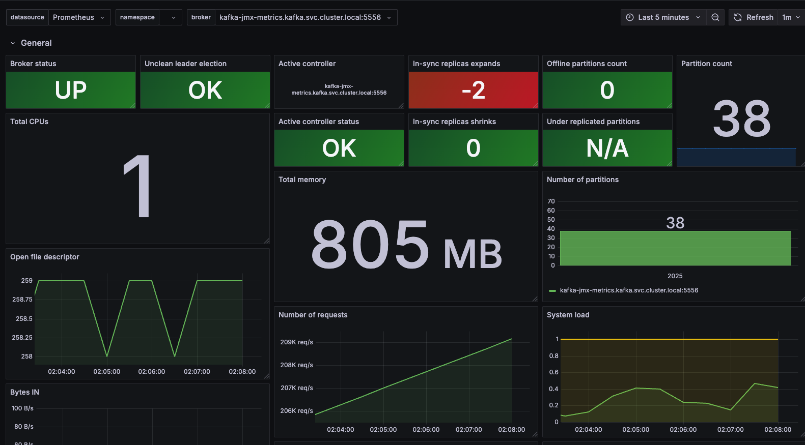
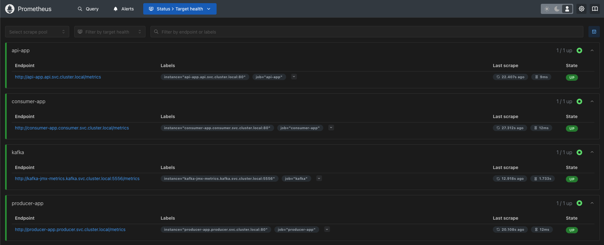
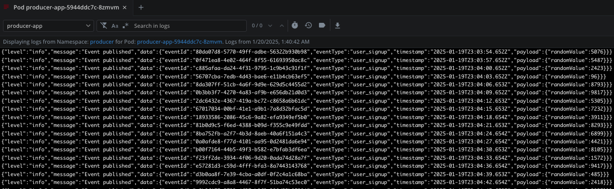
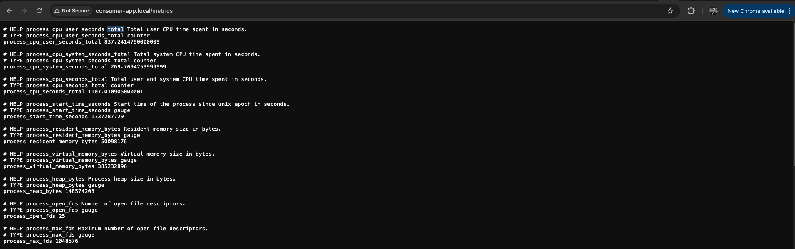
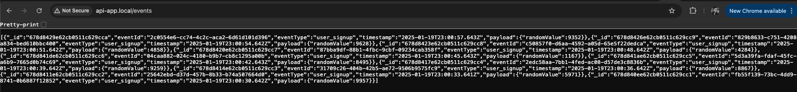
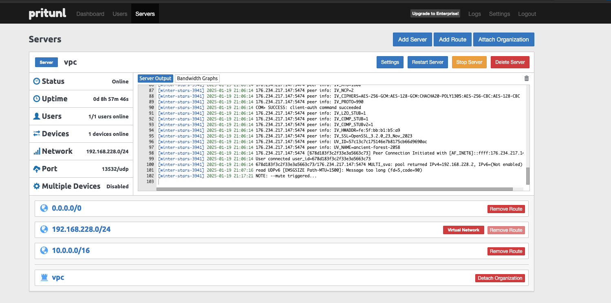

# README: Application Overview and Deployment Guide

This repository contains three microservices—**Producer**, **Consumer**, and **API**—deployed on Kubernetes with a complete infrastructure setup including monitoring, ingress, and service interconnectivity. Below is an overview of the services, the infrastructure components, and deployment steps.

---

## **Infrastructure**

### **1. VPC and EKS Cluster**
- **Terraform** is used to automate infrastructure provisioning on AWS:
  - **VPC**: Configured with private and public subnets to manage application traffic securely.
  - **EKS Cluster**: Kubernetes cluster is created for running and orchestrating services.
- Terraform ensures reproducible and scalable infrastructure deployment.

### **2. Kafka and MongoDB**
- **Bitnami Helm Charts** are used for deploying:
  - **Kafka**: Manages message queues and event streams.
  - **MongoDB**: Stores processed data from the Consumer service.
- A dedicated **Kafka UI Pod** is deployed using a custom YAML file to visualize Kafka brokers, topics, and configurations.


### **3. Ingress with AWS ALB**
- **AWS Load Balancer Controller** is deployed via Helm, integrating Kubernetes Ingress with AWS Application Load Balancer (ALB).
  - Ingress handles traffic routing to internal services.
  - Configured with `internal` mode for secure private access.
  - Pritunl VPN is used to provide access to the internal ALB from developer machines.

### **4. Monitoring and Observability**
- **Kube Prometheus Stack** Helm Chart is used for system and service observability:
  - **Prometheus**: Collects metrics from services and infrastructure.
  - **Grafana**: Visualizes metrics with dashboards for monitoring application performance.
- Each service exposes a `/metrics` endpoint, configured to be scraped by Prometheus.


### **5. Helm Charts**
- Each service is packaged into its own Helm chart for Kubernetes deployment.
  - Configurations such as environment variables and secrets are managed via Kubernetes ConfigMaps and Secrets.
  - Kafka and MongoDB configurations leverage Bitnami Helm Charts.

---

## **Applications**

### **Producer Service**
- **Purpose**: Publishes random events to Kafka topics.
- **Key Features**:
  - Connects to Kafka broker using Helm-provided configurations.
  - Periodically generates and publishes events.
  - Exposes metrics on `/metrics` for Prometheus.



### **Consumer Service**
- **Purpose**: Consumes Kafka events, processes them, and stores the data in MongoDB.
- **Key Features**:
  - Manages retries for message processing with a Dead Letter Queue (DLQ).
  - Stores data in MongoDB.
  - Exposes metrics including message processing statistics.



### **API Service**
- **Purpose**: Provides a RESTful API to access and manage data stored in MongoDB.
- **Key Features**:
  - CRUD operations for processed data.
  - Includes health-check endpoints for monitoring.



---

## **Deployment Guide**

### **Step 1: Prepare Infrastructure**
1. Use Terraform files to create the required VPC and EKS cluster on AWS.
    1. Initialize Terraform
    Set up Terraform by downloading the necessary provider plugins:
    `terraform init`
    2. Plan Infrastructure
    Preview the changes Terraform will make:
    `terraform plan`
    3. Apply Infrastructure
    Deploy the infrastructure:
    `terraform apply`


### **Step 2: Deploy Kafka and MongoDB**
1. Install Kafka and MongoDB using their respective Bitnami Helm charts:
   ```bash
   helm install kafka bitnami/kafka -f values.yaml
   helm install mongodb bitnami/mongodb -f values.yaml


# Deployment and Management Guide

This README provides all the commands required to set up Docker images, deploy infrastructure using Terraform, and manage Kubernetes services including monitoring tools.

---

## **Docker Commands**

#### **1. Authenticate to AWS ECR**
Log in to AWS Elastic Container Registry (ECR):

`aws ecr get-login-password --region eu-north-1 | docker login --username AWS --password-stdin 975050207458.dkr.ecr.eu-north-1.amazonaws.com`

#### 2. Build Docker Images
Navigate to the respective service directory and build the Docker image:

`cd src/producer`
`docker buildx build --platform=linux/amd64 -f Dockerfile .  -t producer-app:latest`

#### 3. Tag Docker Images
Tag the Docker image for the ECR repository:
`docker tag producer-app:latest 975050207458.dkr.ecr.eu-north-1.amazonaws.com/node/producer:1.0`

#### 4. Push Docker Images
Push the Docker image to the ECR repository:
`docker push 975050207458.dkr.ecr.eu-north-1.amazonaws.com/node/producer:1.0`
Repeat the steps for Consumer and API services.

#### 1. Update Kubernetes Context
Set the context to use the correct EKS cluster:
`aws eks update-kubeconfig --region eu-north-1 --name nodejs-cluster`

#### 2. Deploy Kafka and MongoDB
Install Kafka and MongoDB using Bitnami Helm charts:
``helm repo add bitnami https://charts.bitnami.com/bitnami
helm install kafka bitnami/kafka -f kafka-values.yaml
helm install mongodb bitnami/mongodb -f mongodb-values.yaml``

#### 3. Deploy Applications
Install Producer, Consumer, and API services using Helm:
`helm install producer ./charts/producer -n producer
helm install consumer ./charts/consumer -n consumer
helm install api ./charts/api -n api`

#### 4. Monitor Kubernetes Resources
Check the status of various Kubernetes resources:
`kubectl get pods -n producer
kubectl get services -n producer
kubectl get ingress -n producer`

#### 1. Deploy AWS Load Balancer Controller
Install the AWS Load Balancer Controller for managing ALB:
`helm repo add eks https://aws.github.io/eks-charts
helm install aws-load-balancer-controller eks/aws-load-balancer-controller \
  -n kube-system \
  --set clusterName=nodejs-cluster \
  --set serviceAccount.create=false \
  --set serviceAccount.name=aws-load-balancer-controller`

#### 1. Install Kube Prometheus Stack
Deploy Prometheus and Grafana for monitoring:
`helm repo add prometheus-community https://prometheus-community.github.io/helm-charts
helm install kube-prometheus-stack prometheus-community/kube-prometheus-stack -n monitoring --create-namespace`
#### 2. Access Grafana
Retrieve the Grafana admin password and access the dashboard:
`kubectl get secret -n monitoring kube-prometheus-stack-grafana -o jsonpath="{.data.admin-password}" | base64 --decode
kubectl port-forward -n monitoring svc/kube-prometheus-stack-grafana 3000:80`

### 1. Install Pritunl

Install Pritunl on a separate EC2 instance to provide VPN access to internal services:

> ```bash
> sudo tee /etc/apt/sources.list.d/mongodb-org.list << EOF
> deb [ signed-by=/usr/share/keyrings/mongodb-server-8.0.gpg ] https://repo.mongodb.org/apt/ubuntu noble/mongodb-org/8.0 multiverse
> EOF
>
> sudo tee /etc/apt/sources.list.d/openvpn.list << EOF
> deb [ signed-by=/usr/share/keyrings/openvpn-repo.gpg ] https://build.openvpn.net/debian/openvpn/stable noble main
> EOF
>
> sudo tee /etc/apt/sources.list.d/pritunl.list << EOF
> deb [ signed-by=/usr/share/keyrings/pritunl.gpg ] https://repo.pritunl.com/stable/apt noble main
> EOF
>
> sudo apt --assume-yes install gnupg
>
> curl -fsSL https://www.mongodb.org/static/pgp/server-8.0.asc | sudo gpg -o /usr/share/keyrings/mongodb-server-8.0.gpg --dearmor --yes
> curl -fsSL https://swupdate.openvpn.net/repos/repo-public.gpg | sudo gpg -o /usr/share/keyrings/openvpn-repo.gpg --dearmor --yes
> curl -fsSL https://raw.githubusercontent.com/pritunl/pgp/master/pritunl_repo_pub.asc | sudo gpg -o /usr/share/keyrings/pritunl.gpg --dearmor --yes
> sudo apt update
> sudo apt --assume-yes install pritunl openvpn mongodb-org wireguard wireguard-tools
>
> sudo ufw disable
>
> sudo systemctl start pritunl mongod
> sudo systemctl enable pritunl mongod
> ```




## Bonus Points Implemented
#### Prometheus Metrics:

1. All microservices expose a /metrics endpoint that Prometheus can scrape to collect metrics such as published message counts, processed events, and failure statistics.
Retries and Dead Letter Queue (DLQ):

2. The Kafka Consumer service is equipped with retry logic for failed messages.
After exhausting retries, unprocessable messages are forwarded to a Dead Letter Queue (DLQ) for further inspection or debugging.
Infrastructure as Code with Terraform:

3. Used Terraform to provision the VPC, EKS cluster, and other AWS resources required for the deployment.
This ensures consistent, repeatable, and version-controlled infrastructure management.

#### Scalability, Fault Tolerance, and Security
Scalability
Horizontal Scaling:
Producer, Consumer, and API services are stateless and can be horizontally scaled by increasing the number of replicas using Kubernetes Deployments.
Kafka and MongoDB are deployed with Bitnami Helm charts, which support multi-node setups for scaling.
Resource Requests and Limits:
Kubernetes resources settings are defined in Helm charts to allocate sufficient CPU and memory, ensuring predictable performance under load.
Load Balancing:
AWS ALB (Application Load Balancer) is used for traffic distribution across replicas of API and other services.

#### Fault Tolerance
Retries and Dead Letter Queue (DLQ):
Consumer service retries failed messages a configurable number of times before forwarding them to a Dead Letter Queue (DLQ).
#### High Availability:
MongoDB is deployed with replica sets for redundancy.
Kafka uses replication across brokers to ensure message durability.
Health Checks:
Liveness and readiness probes are configured for all services to detect and recover from failures automatically.

#### Areas for Improvement
##### 1. Secrets Management
Current: Environment variables are stored as plain Kubernetes Secrets.
Improvement:
Use AWS KMS with SOPS to encrypt sensitive data.
Decrypt secrets only at runtime, ensuring secure storage and access.
##### 2. CI/CD Pipeline
Current: Manual deployment of services using Helm.
Improvement:
Implement a CI/CD pipeline using GitHub Actions or Jenkins to automate build, test, and deployment processes.

##### 3. GitOps Workflow:

##### 4. Introduce ArgoCD for GitOps-based deployments.
Configure the App of Apps or ApplicationSet model to manage multiple microservices and infrastructure components from a single source of truth.
Automate updates to Helm charts and Kubernetes manifests directly from the Git repository.

## Accessing Ingress from the Browser

If you want to access the Ingress through your browser, while connected to the Pritunl VPN, follow the steps below:

### Add Entries to `/etc/hosts`

> ### Add the Following Entries to `/etc/hosts`
> ```plaintext
> 10.0.3.40 consumer-app.local
> 10.0.3.40 api-app.local
> 10.0.3.40 producer-app.local
> 10.0.3.40 grafana.local
> 10.0.3.40 prometheus.local
> ```

---

```plaintext
├── README.md                  # This document
├── charts                     # Helm charts for applications and infrastructure
│   ├── infra                  # Infrastructure-related Helm charts
│   │   ├── aws-load-balancer-controller  # ALB Controller Helm chart
│   │   ├── kafka                        # Kafka Helm chart
│   │   ├── kafka-ui.yaml                # Kafka UI YAML
│   │   ├── kube-prometheus-stack        # Prometheus and Grafana Helm chart
│   │   └── mongodb                      # MongoDB Helm chart
│   ├── apps                   # Application-related Helm charts
│       ├── api-app            # API service Helm chart
│       ├── consumer-app       # Consumer service Helm chart
│       └── producer-app       # Producer service Helm chart
├── terraform                  # Terraform scripts for infrastructure
│   ├── main.tf                # Main Terraform configuration
│   ├── outputs.tf             # Outputs definition
│   └── variables.tf           # Variable definitions
├── src                        # Application source code
│   ├── producer               # Producer service
│   │   ├── Dockerfile         # Dockerfile for Producer
│   │   ├── index.js           # Main application file
│   │   └── package.json       # NPM package configuration
│   ├── consumer               # Consumer service
│   │   ├── Dockerfile         # Dockerfile for Consumer
│   │   ├── index.js           # Main application file
│   │   └── package.json       # NPM package configuration
│   └── api                    # API service
│       ├── Dockerfile         # Dockerfile for API
│       ├── index.js           # Main application file
│       └── package.json       # NPM package configuration
